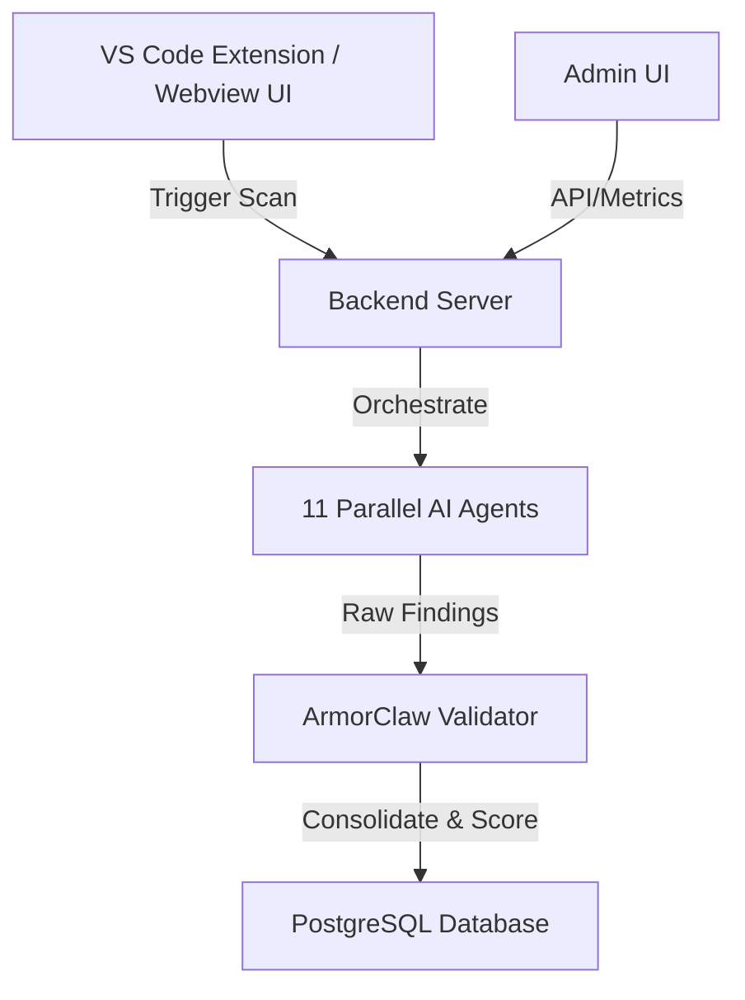

<div align="center">
  
  <h1>CodeArmor — AI-Powered Security Scanner for VS Code</h1>
</div>

CodeArmor is a premium security tool that automatically scans your codebase for security vulnerabilities.

## What It Does
CodeArmor runs 11 parallel AI agents to detect security weaknesses in your projects, validates and consolidates findings via the ArmorClaw service, and displays findings in an interactive VS Code panel and standalone Admin dashboard.

## Vulnerability Coverage
CodeArmor scans for 40+ vulnerability types across 11 AI agents:
1. **Route Analyst**: Endpoint structures, missing input validations, path parameter security.
2. **Auth Inspector**: Missing authentication, IDOR vulnerabilities, inadequate role-based access controls.
3. **Injection Hunter**: SQL Injection, NoSQL Injection, Command Injection, LDAP Injection, XPath Injection, Template Injection.
4. **Data Flow Tracer**: Sensitive data in logs, verbose error message exposures, sensitive responses, data in URLs.
5. **Config Auditor**: Unencrypted credentials, CORS misconfigurations, missing security headers, missing rate limits, debug settings active in production.
6. **XSS Scanner**: Reflected XSS, Stored XSS, DOM XSS, unsafe templating engines.
7. **CSRF Scanner**: Missing CSRF protection, incorrect SameSite cookie attributes.
8. **File Security Agent**: Path traversal, unrestricted file upload, insecure file permissions.
9. **API Security Agent**: Mass assignment, IDOR, input validations.
10. **Business Logic Agent**: Open redirects, SSRF, insecure deserialization, race conditions, business logic bypass.
11. **Crypto Auditor**: Weak ciphers, hardcoded IVs, insecure random generation, missing encryption, hardcoded secrets.

## Tech Stack
- **Extension**: VS Code Extension API, TypeScript, React, esbuild.
- **Backend**: Node.js, Express, PostgreSQL, Drizzle ORM, bcryptjs, jwt.
- **Admin UI**: React, Vite, Tailwind CSS, Axios.

## Architecture Overview


## Security Score Formula
CodeArmor calculates a security score out of 100 using a deduction-based formula:

$$\text{Score} = \max(0, 100 - \text{CriticalDeduction} - \text{WarningDeduction} - \text{InfoDeduction})$$

Where deductions are:
- **CRITICAL Findings**: -15 points each (capped at -60)
- **WARNING Findings**: -5 points each (capped at -30)
- **INFO Findings**: -1 point each (capped at -10)

## Project Structure
CodeArmor adopts a feature-based (domain-driven) folder structure to ensure scalability and maintainability:

```text
codearmor/
├── backend/
│   └── src/
│       ├── features/
│       │   ├── admin/       # Admin-related APIs
│       │   ├── armoriq/     # ArmorIQ / ArmorClaw integration
│       │   ├── auth/        # Authentication APIs
│       │   └── scan/        # Security scanning orchestration
│       ├── db/              # Drizzle ORM setup and schema
│       └── agents/          # AI agent definitions
├── admin-ui/                # React UI for managing vulnerabilities
└── extension/               # VS Code extension and Webview UI
```

## Quick Start & Setup
1. **Environment Setup**:
   Copy `.env.example` to `.env` in the `backend/` directory and configure keys.
2. **Setup DB**:
   ```bash
   cd backend
   npm install
   npm run setup-db
   npm run create-admin
   ```
3. **Run Backend**:
   ```bash
   npm run dev
   ```
4. **Run Admin UI**:
   ```bash
   cd ../admin-ui
   npm install
   npm run dev
   ```
5. **Run Extension**:
   Open `extension/` in VS Code and press `F5` to start debugging.
